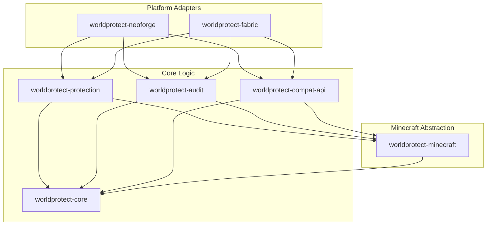

# Architecture

`worldProtect` uses a highly decoupled multi-module architecture designed to split the domain logic, region protection, audit logs, and modloader-specific integration layers.

## High-Level Design: Core vs. Platform (WorldEdit Inspiration)

Following the proven architecture of WorldEdit, `worldProtect` separates its design into core business logic and loader-specific platform adapters:
- **Core Modules (`worldprotect-core`, `worldprotect-protection`, `worldprotect-audit`)**: House pure Java code, domain models, and logic rules. They do not depend on loader APIs or Minecraft classes.
- **Platform Adapters (`worldprotect-fabric`, `worldprotect-neoforge`)**: Bind the core logic to the game loop. They intercept events (e.g. block placement, right-clicks) and forward them to the core services.

This ensures that the business logic can be tested entirely using lightweight JUnit tests without spinning up a heavy Minecraft server instance.

## Generic Inventory Strategy

Generic inventory access should start from platform-independent snapshots and later be backed by vanilla menus/block entities, NeoForge IItemHandler and Fabric Transfer API.

## Resource ID Validation Strategy

We employ a strict two-layered validation process for all Minecraft identifiers and resource keys:

1. **Syntactic Validation**: Checked immediately upon parsing inside `ResourceRef`. This verifies that the namespace and path conform to strict Minecraft character sets (only lowercase, digits, dots, dashes, and underscores/slashes) and correct formats, preventing config errors from executing.
2. **Semantic Validation**: Evaluated against the `ResourceRegistryView` using a `ResourceValidator`. This checks whether a syntactically correct identifier is actually registered on the current modpack/server runtime (e.g., verifying if a custom block or mod exists). Fabric and NeoForge adapter modules will later supply concrete implementations of this registry view from live game registries.

## Threading Rules

To ensure server performance and database integrity, we adhere to the following concurrency guidelines:

- **Asynchronous Database Log Queue**: All audit logging, database writes, and lookup queries must run asynchronously off the main server thread. Database operations must never block the main game loop.
- **Synchronous World Modifications**: Any operations modifying blocks, entities, or inventories (such as executing a rollback) MUST occur on the Minecraft server main thread to prevent race conditions and chunk corruption.
- **Rollback Planning Separation**: When performing a rollback, the system must generate a read-only `RollbackPlan` first (asynchronously). Once finalized, the plan is scheduled to apply its operations on the main thread incrementally.

## Loader Boundary Rules

- **Platform Modules are Adapters Only**: `worldprotect-fabric` and `worldprotect-neoforge` are adapters that translate platform-specific events (e.g., Fabric events or NeoForge event bus events) to `worldProtect` core API calls.
- **No Domain Logic in Loader Modules**: Code inside loader modules must only handle bootstrap, event registration, injection (mixins), configuration mapping, and command registration. Actual logic remains in `worldprotect-core`, `worldprotect-protection`, and `worldprotect-audit`.
