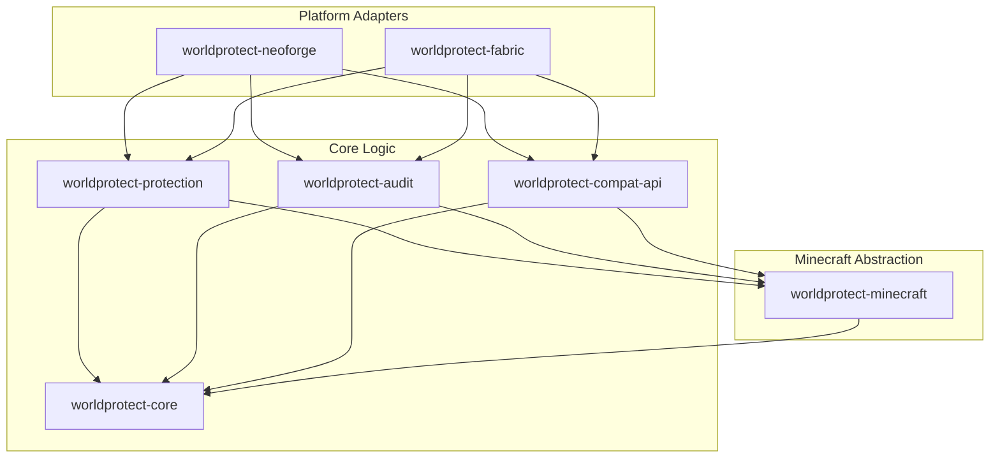

# Architecture

`worldProtect` uses a highly decoupled multi-module architecture designed to split the domain logic, region protection, audit logs, and modloader-specific integration layers.

## High-Level Design: Core vs. Platform (WorldEdit Inspiration)

Following the proven architecture of WorldEdit, `worldProtect` separates its design into core business logic and loader-specific platform adapters:
- **Core Modules (`worldprotect-core`, `worldprotect-protection`, `worldprotect-audit`)**: House pure Java code, domain models, and logic rules. They do not depend on loader APIs or Minecraft classes.
- **Platform Adapters (`worldprotect-fabric`, `worldprotect-neoforge`)**: Bind the core logic to the game loop. They intercept events (e.g. block placement, right-clicks) and forward them to the core services.

This ensures that the business logic can be tested entirely using lightweight JUnit tests without spinning up a heavy Minecraft server instance.



## Generic Inventory Strategy

Generic inventory access should start from platform-independent snapshots and later be backed by vanilla menus/block entities, NeoForge IItemHandler and Fabric Transfer API.

## Protection Query and Resolution Model

We model all world protection checks using a clean, platform-independent representation of actions, causes, and targets:
- **Action/Cause/Target Queries**: Every protection request is wrapped in a `ProtectionQuery` containing:
  - An explicit `Actor` responsible for the action.
  - A logical `ProtectionAction` representing the activity (e.g., `BUILD`, `BLOCK_BREAK`, `CONTAINER_OPEN`, `WORLD_MODIFY`). Modded interactions are normalized into these actions.
  - A `CauseChain` detailing how the action occurred (e.g., player -> wrench item -> block modify).
  - A `ProtectionTarget` detailing what is being acted upon (e.g., block, item, entity, container, fluid, or position).
- **Explosion & Drop Separation**: Explosions evaluate separate decisions for block damage (`EXPLOSION_BLOCK_DAMAGE`), entity damage (`EXPLOSION_ENTITY_DAMAGE`), and item drops (`EXPLOSION_ITEM_DROP`). Additionally, block/entity drops are protected independently (`BLOCK_DROP`, `ENTITY_DROP`) from the action that caused the destruction.
- **Loader Decoupling**: Fabric and NeoForge adapter modules will later translate physical game events into structured `ProtectionQuery` objects and delegate decision-making to the `ProtectionResolver`.

### Flag Specificity Precedence
Protection actions can map to multiple flags ordered from most specific to most generic.
Examples:
- `ITEM_USE_ON_BLOCK` checks `use-item-on-block` before `use-item`.
- `BLOCK_BREAK` checks `break-block` before `build`.

The first explicit decision found at the highest applicable priority level wins according to this mapped flag order. This means a specific flag can override a broader fallback flag.
Within the same priority group and same evaluated flag:
- `DENY` beats `ALLOW`
- `ALLOW` beats `PASS`
- `PASS` means continue

## Region Permission and Subject Model

We support a platform-independent permission and subject domain model for region protections. This separates identity (players, groups, system, console) and permissions from platform-specific APIs.

- **Subjects & References (`SubjectRef`)**: Represents actors by logical types (`PLAYER`, `GROUP`, `CONSOLE`, `SYSTEM`).
- **Region Roles (`RegionRole`)**: Standardizes roles (`OWNER`, `MEMBER`, `NONE`) with a natural precedence (`OWNER` > `MEMBER` > `NONE`).
- **Access Policies (`RegionAccessPolicy`)**: Configures whether owners and members bypass specific flags within a region.
- **Permission Sets (`PermissionSet`)**: Contains structured, immutable `PermissionKey` elements (hierarchical segment-aware checking using `startsWith`) for evaluating permissions like global bypass (`worldprotect.bypass`) or flag bypasses (`worldprotect.bypass.flag.<flag>`).
- **Subject Context (`ProtectionSubjectContext`)**: Bundles an actor's subjects and their active permissions to resolve checks.
- **Subject Resolver (`SubjectResolver`)**: Decouples role matching, global bypasses, and flag/region role bypass evaluation.

### Region Subjects and Access Policy in Configuration

We support defining region subjects (owners and members) and access policies directly in the TOML configuration:
- **`RegionSubjectsConfig`**: Declares region owners and members using prefix strings (e.g., `player:<uuid>`, `group:<name>`, `console`, `system`). Validates correct format and raises warnings for duplicate declarations or overlapping owners/members.
- **`RegionAccessPolicyConfig`**: Configures access and bypass permissions for owners and members (e.g., `owners-bypass = true/false`, `owner-bypass-flags = [...]`). Keeps bypass flags as `List<String>` at the parser level to avoid upfront parsing exceptions. Flag syntax validation, registry checks, and duplicate detection occur during structural validation.

## Conditional Flag Rules and Resource Selectors

Region flags can be configured as simple states or as complex conditional rules:
- **Simple Flags**: Retains compatibility with `ALLOW`, `DENY`, or `PASS` states, which are stored as rules with a simple fallback state and no resource filters.
- **Conditional Rules (`FlagRule`)**: Configured with a default fallback state, allow selectors, and deny selectors. Evaluation order checks the deny list first, then the allow list, and falls back to the default state.
- **Resource Selectors (`ResourceSelector`)**: Selectors can target resources using four matching kinds:
  - `EXACT`: Matches an exact resource ID (e.g. `minecraft:stone`).
  - `NAMESPACE_WILDCARD`: Matches any resource inside a mod namespace (e.g. `create:*`).
  - `GLOBAL_WILDCARD`: Matches any resource ID (represented as `*`).
  - `TAG`: Represents tag selectors (e.g. `#forge:chests` or `#c:tools`). The tag syntax parses syntactically, but does not match raw `ResourceRef` checks until a future `TagRegistryView` database/abstraction is added.
- **Query Resource Extraction**: The `QueryResourceExtractor` is responsible for selecting the primary target resource from a query (e.g., target block, used item, target container, drop item, fluid) depending on the action checked, allowing modded items, containers, block entities, fluids, and explosions to be filtered by resource ID.


## Global / Dimension-Wide Regions

We support defining global, dimension-wide regions (e.g., `bounds.type = "global"`) to protect entire dimensions:
- **Spatial Containment**: Unlike cuboid regions that define `min` and `max` coordinate boundaries, a `GlobalRegion` contains all spatial coordinates. Its `contains(BlockPosRef)` method always returns `true` after verifying that the queried position is non-null.
- **Dimension Isolation**: To ensure a global region only matches positions within its configured dimension, the `RegionSet.matching(...)` system validates that the query dimension matches the region's dimension (`dimension.equals(region.getDimension())`) before checking spatial containment. A global region never matches queries from other dimensions.
- **Priority and Overrides**: Global regions are integrated into the priority sorting model alongside cuboid regions. Cuboid regions with higher priority (e.g. priority 100) override lower-priority global regions (e.g. priority -1000000) inside their coordinates, functioning similarly to WorldGuard global regions.
- **Configuration & Validation**: In the configuration model (`BoundsConfig`), a global bounds type has no coordinate requirements. Calling `min()` or `max()` on a global `BoundsConfig` throws `IllegalStateException`. To prevent silent errors during mapping, safe access is provided via `minOptional()` and `maxOptional()`. If coordinates are specified in a TOML config under a global bounds type, the parser emits a `WARNING` diagnostic but parses the region successfully, ignoring the useless coordinates.


## Region Inheritance / Parent Model

We support region inheritance where child regions can declare a parent reference (`parent = "<region_id>"`):
- **Lineage Ordering**: When resolving properties, a region's lineage is constructed starting child-first (child, parent, grandparent, ..., root parent). Any cycle (circular reference) or missing parent reference is validated and rejected with detailed diagnostics.
- **Lineage Dimension Constraint**: A parent region must reside in the exact same dimension as its child.
- **Effective Flag Resolution**: Flag rules are resolved in a child-first manner (the first explicit flag rule defined in the lineage is applied).
- **Effective Subject Merging**: Owners and members are aggregated across the lineage. To determine the actor's role in the matched region, all owners and members in the lineage are merged. The owner role overrides the member role globally.
- **Local Access Policies**: Region access policies (`RegionAccessPolicy`) are strictly local and are NOT inherited. Bypass rules (e.g. owner/member bypass permissions or role bypasses) always check only the matched child region's access policy.
- **Permission Bypass Isolation**: Actor bypass permissions are child-specific. Parent-specific bypass permissions (e.g. `worldprotect.region.parent.owner`) cannot bypass decisions in a child region.


## Region-Group Scoped Flags

We support scoping flag rules to specific region groups based on the actor's membership role within the region:
- **Region Groups (`RegionGroup`)**: Represents subsets of roles in the region:
  - `all`: Matches any actor role (default).
  - `owners`: Matches only owners (`RegionRole.OWNER`).
  - `members`: Matches owners and members (`RegionRole.OWNER` or `RegionRole.MEMBER`).
  - `nonowners`: Matches members and non-members (`RegionRole.MEMBER` or `RegionRole.NONE`).
  - `nonmembers`: Matches only non-members (`RegionRole.NONE`).
- **TOML Configuration Syntax**: Defined under table-based flags by specifying a `group` string property:
  ```toml
  [regions.spawn.flags.break-block]
  state = "deny"
  group = "members"
  ```
- **Lineage Traversal with Role Scoping**: Traversal is performed child-first using `effectiveFlagRule(region, flagKey, role)`. A rule is only considered applicable if the actor's resolved `RegionRole` (computed using effective inherited subjects) matches the rule's `RegionGroup`. Rules that do not match are treated as not applicable, allowing fallback to parent matching rules in the lineage.
- **Bypass & Access Policies**: The region access policy remains strictly local to the matched region. Bypass permissions (owner/member) are checked against the matched region's ID and access policy.


## Build and Passthrough Semantics

Build-related actions (`BLOCK_BREAK`, `BLOCK_PLACE`, `BLOCK_MODIFY`, and the generic `BUILD`) follow a specialized three-step resolution order managed by `BuildDecisionResolver`:

1. **Specific Flags (Step 1)**: Action-specific flags are evaluated first (e.g., `break-block` for `BLOCK_BREAK`). These follow standard priority grouping and flag resolution. Passthrough does **NOT** skip specific flags.
2. **Explicit Build Fallback (Step 2)**: The generic `build` flag is evaluated. If a region has `passthrough = allow`, that region is skipped for this step. Same-priority deny beats allow.
3. **Implicit Membership Build (Step 3)**: Membership-based implicit protection activates only for spatial (non-global) regions that have effective subjects and no `passthrough = allow`. Owner and member actors get implicit `ALLOW`; non-members get implicit `DENY` (with access policy bypass checks using the `build` flag key).

### Key Rules
- **Passthrough Controls Participation**: The `passthrough` flag controls whether a region participates in build fallback (step 2) and implicit membership protection (step 3). It does NOT directly deny or allow actions.
- **Global Regions Excluded from Implicit Build**: `GlobalRegion` instances never activate implicit membership build protection. To protect an entire dimension, the config must explicitly set `build = "deny"` or other protection flags.
- **Non-Build Actions Unaffected**: Passthrough and implicit membership only affect build-related actions. Non-build actions (e.g., `CONTAINER_OPEN`, `ENTITY_DAMAGE`) follow the standard `ActionFlagMapper` resolution.
- **ActionFlagMapper Isolated**: For build-related actions, `ActionFlagMapper` only returns the action-specific flag (not `build`). The build fallback chain is handled entirely by `BuildDecisionResolver`.


## In-Memory Configuration Model

We represent the plugin configuration in memory using a platform-independent model that mirrors the logical structure of a future persistent file layout (e.g. YAML/TOML/JSON).

- **No File Parsing**: This layer does not parse physical configuration files directly. It deals purely with Java configuration representation objects (`WorldProtectConfig`, `RegionConfig`, `FlagRuleConfig`, `BoundsConfig`).
- **Two-Layer Config Validation**:
  1. **Structural Validation**: Validates coordinate bounds compatibility (e.g. `min <= max`), checks that flag keys are known in the registered `FlagRegistry`, validates selector syntax, and rejects duplicate region IDs. This is performed entirely in memory without game registries.
  2. **Semantic Registry Validation**: Performed by `ConfigResourceValidator`. It checks whether namespaces of EXACT and `NAMESPACE_WILDCARD` selectors exist in the active `ResourceRegistryView`. It produces warnings for tags since tag membership checks require runtime resolution.
- **Config-to-Domain Mapping**: The `ConfigToDomainMapper` class acts as the translator converting validated configuration objects directly into active domain entities (`RegionSet`, `CuboidRegion`, `RegionFlags`, `FlagRule`).
- **Loader Decoupling**: Platform adapter modules (Fabric/NeoForge) must not implement mapping or configuration domain logic. They will only parse file formats into the in-memory config model and trigger validation.


## TOML Configuration Parser

The TOML configuration parser is isolated under the `worldprotect-config` module.

- **Parser Isolation**: Only the `worldprotect-config` module depends on the TOML parsing library (`org.tomlj:tomlj`). The core and domain protection modules remain clean and independent of any parser library.
- **Conversion to Config Model**: The parser reads TOML content or files and converts them into the existing platform-independent configuration model (`WorldProtectConfig`).
- **Parser-Level Error Handling**: The parser handles syntax errors, missing required fields, and incorrect TOML value types. It generates detailed diagnostics with `ERROR` severity for any structural errors.
- **Separation of Validation Concerns**:
  1. Parser validates TOML syntax, types, and schema.
  2. Domain validation (`validate(FlagRegistry)`) checks for unknown flags, bounds, and selector syntax.
  3. Semantic validation (`ConfigResourceValidator`) checks namespaces against the runtime `ResourceRegistryView`.
- **Loader Decoupling**: No loader APIs or Minecraft runtime dependencies are involved in the parsing process. Platform adapter modules will later utilize this parser to bootstrap region settings.


## Config Load Pipeline

The configuration load pipeline is coordinated by the `ConfigLoadService` under the `worldprotect-config` module.

- **Unified Service Entry**: Loaders invoke `ConfigLoadService.load(ConfigSource, ConfigLoadOptions)` to load and compile a region set.
- **Pipeline Abstractions**:
  - `ConfigSource` (`StringTomlConfigSource`, `FileTomlConfigSource`): Abstract access to configuration data.
  - `LoadedWorldProtectConfig`: Holds successfully loaded configurations, including raw structures, mapped `RegionSet`, and non-fatal diagnostics. Rejects inputs containing errors.
  - `ConfigLoadResult`: Wraps success/failure outcomes and carries validation diagnostics.
  - `ConfigLoadOptions`: Configures load parameters (e.g. `validateResources` and `failOnWarnings`).
- **Strict Mode Behavior**: When `failOnWarnings` is active, any warning diagnostic (such as the warning raised when resource validation is requested but no `ResourceRegistryView` is provided) is converted into a fatal error, failing the load operation.
- **Robust Error Trapping**: The service guarantees no unexpected runtime exceptions are thrown out of the pipeline. All parsing errors, structural validation errors, registry/resource validation errors, and mapper mapping exceptions are caught and wrapped inside a failed `ConfigLoadResult`. Null parameters to constructors/methods still throw standard NullPointerExceptions.


## Region Management Domain

We support a platform-independent region management layer inside `worldprotect-protection`.

- **Domain-Level Management Only**: `RegionManagementService` models command intent and config mutations in pure Java. It does not parse Brigadier/Minecraft command input itself.
- **Immutable Mutation Flow**: Region create/delete/update operations never mutate `WorldProtectConfig` or `RegionConfig` instances in place. Each operation returns a new immutable `WorldProtectConfig`.
- **Adapter Boundary**: Future NeoForge/Fabric command adapters will parse `/wp region ...` input and translate it into typed request objects for this service.
- **Validation Reuse**: Mutations reuse the existing config validation stack (`WorldProtectConfig.validate(...)`, hierarchy validation, flag validation, subject validation, and access-policy validation) after applying changes.
- **Read Views**: `RegionInfoView` and `RegionListView` provide immutable projections for future command output adapters.
- **Mutation Plans**: `RegionMutationPlan` captures before/after mutation intent for future previews, audit integration, persistence workflows, and rollback planning without implementing those systems yet.
- **No Save-Back Yet**: This layer does not save TOML files, watch files, or perform runtime persistence/save-back. That is intentionally a later phase.
- **No Runtime Side Effects**: This layer does not perform Minecraft enforcement, loader event registration, database logging, rollback, inventory logging, or WorldEdit integration.

## Resource ID Validation Strategy

We employ a strict two-layered validation process for all Minecraft identifiers and resource keys:

1. **Syntactic Validation**: Checked immediately upon parsing inside `ResourceRef`. This verifies that the namespace and path conform to strict Minecraft character sets (only lowercase, digits, dots, dashes, and underscores/slashes) and correct formats, preventing config errors from executing.
2. **Semantic Validation**: Evaluated against the `ResourceRegistryView` using a `ResourceValidator`. This checks whether a syntactically correct identifier is actually registered on the current modpack/server runtime (e.g., verifying if a custom block or mod exists). Fabric and NeoForge adapter modules will later supply concrete implementations of this registry view from live game registries.

## Threading Rules

To ensure server performance and database integrity, we adhere to the following concurrency guidelines:

- **Asynchronous Database Log Queue**: All audit logging, database writes, and lookup queries must run asynchronously off the main server thread. Database operations must never block the main game loop.
- **Synchronous World Modifications**: Any operations modifying blocks, entities, or inventories (such as executing a rollback) MUST occur on the Minecraft server main thread to prevent race conditions and chunk corruption.
- **Rollback Planning Separation**: When performing a rollback, the system must generate a read-only `RollbackPlan` first (asynchronously). Once finalized, the plan is scheduled to apply its operations on the main thread incrementally.

## Loader Boundary Rules

- **Platform Modules are Adapters Only**: `worldprotect-fabric` and `worldprotect-neoforge` are adapters that translate platform-specific events (e.g., Fabric events or NeoForge event bus events) to `worldProtect` core API calls.
- **No Domain Logic in Loader Modules**: Code inside loader modules must only handle bootstrap, event registration, injection (mixins), configuration mapping, and command registration. Actual logic remains in `worldprotect-core`, `worldprotect-protection`, and `worldprotect-audit`.
